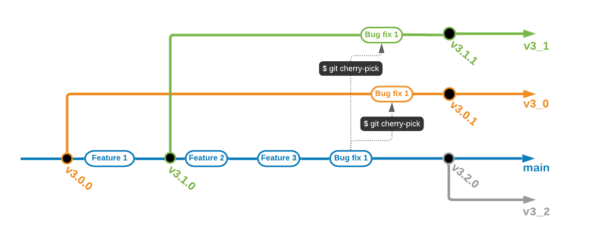

# Contributing

This document provides guidelines on contributing to this repository. Please
follow these guidelines when creating issues, making commits, and submitting
pull requests. The repository maintainers review all pull requests and verify
that they conform to these guidelines before approving and merging.

Please note we have a code of conduct, please follow it in all your
interactions with the project.

## Github work flow

### Versioning

Major version number is composed by the two first digits: **3.0**.1

Minor version number is the third digit: 3.0.**1**

The first digit is used to mark significant changes, like new interface, new
API version, programming language changes, etc...

**Major version** examples: 3.1.0, 4.0.0, 5.2.0

**Minor version** examples: 3.1.10, 4.0.1, 5.2.7

### Releases

**Major** release brings **new features** and **bug fixes**

**Minor** release brings **only bug fixes**

### Branches

  * **master** branch is dedicated to development of new features.
  * Each **new major release** is created from **master** branch.
  * Each new major release is immediately followed by the **maintenance branch creation**.
  * Maintenance branches should be named like the major version number it refers
    to: **v3_1**, **v4_0**, etc..
  * Bug fixes impacting only one major version must be applied on its
    maintenance branch only.
  * Bug fixes impacting all or many of the major versions must be applied first
    on master, and then backported on the maintenance branches.
  * **Maintenance releases** are created from **the maintenance branch**.



### How to submit code contribution

**Initialization**

  1. Fork the main repository into user Github account
  2. Clone the repository on the workstation form user fork:
```shell
$ git clone git@github.com:<user>/edb-ansible.git
```
  3. Go to repository folder
  4. Add main repository as an upstream repository:
```shell
$ git remote add upstream https://github.com/EnterpriseDB/edb-ansible.git
```

**Contribution submission**

  1. Update local code:
```shell
$ git remote update
$ git checkout master
$ git merge upstream/master
```
  2. Create a new branch:
```shell
$ git checkout -b new_feature upstream/master
```
  3. Commit your awesome feature
  4. Push the branch on your forked repository:
```shell
$ git push origin new_feature
```
  5. Create the Pull Request by opening the web link:
     `https://github.com/<user>/edb-ansible/pull/new/new_feature`


## Contribution Ideas

1. Raise issues for bugs, features, and enhancements.
2. Submit updates and improvements to the documentation.
3. Submit articles and guides, which are also part of the documentation.
4. Help out repo maintainers by answering questions.
5. Share feedback and let us know about interesting use cases.

## What should I know before I get started?

The best way to directly collaborate with the project contributors is through
GitHub.

* If you want to raise an issue such as a defect, an enhancement request,
  feature request, or a general issue, please open a GitHub issue.
* If you want to contribute to our code by either fixing a problem, enhancing
  some code, or creating a new feature, please open a GitHub pull request
  against the master branch.

Before you start to code, we recommend discussing your plans through a GitHub
issue, especially for more ambitious contributions. This gives other
contributors a chance to point you in the right direction, give you feedback on
your design, and help you find out if someone else is working on the same
thing.

It is your responsibility to test and verify, prior to submitting a pull
request, that your updated code doesn't introduce any bugs. Please write a
clear commit message for each commit. Brief messages are fine for small
changes, but bigger changes warrant a little more detail (at least a few
sentences).

Note that all patches from all contributors get reviewed.

After a pull request is made, other contributors will offer feedback. If the
patch passes review, a maintainer will accept it with a comment.
When a pull request fails review, the author is expected to update the pull
request to address the issue until it passes review and the pull request merges
successfully.

At least one review from a maintainer is required for all patches.

# Code of Conduct

## Our Pledge

We as members, contributors, and leaders pledge to make participation in our
community a harassment-free experience for everyone, regardless of age, body
size, visible or invisible disability, ethnicity, sex characteristics, gender
identity and expression, level of experience, education, socio-economic status,
nationality, personal appearance, race, religion, or sexual identity
and orientation.

We pledge to act and interact in ways that contribute to an open, welcoming,
diverse, inclusive, and healthy community.

## Our Standards

Examples of behavior that contributes to a positive environment for our
community include:

* Demonstrating empathy and kindness toward other people
* Being respectful of differing opinions, viewpoints, and experiences
* Giving and gracefully accepting constructive feedback
* Accepting responsibility and apologizing to those affected by our mistakes,
  and learning from the experience
* Focusing on what is best not just for us as individuals, but for the
  overall community

Examples of unacceptable behavior include:

* The use of sexualized language or imagery, and sexual attention or
  advances of any kind
* Trolling, insulting or derogatory comments, and personal or political attacks
* Public or private harassment
* Publishing others' private information, such as a physical or email
  address, without their explicit permission
* Other conduct which could reasonably be considered inappropriate in a
  professional setting

## Enforcement Responsibilities

Community leaders are responsible for clarifying and enforcing our standards of
acceptable behavior and will take appropriate and fair corrective action in
response to any behavior that they deem inappropriate, threatening, offensive,
or harmful.

Community leaders have the right and responsibility to remove, edit, or reject
comments, commits, code, wiki edits, issues, and other contributions that are
not aligned to this Code of Conduct, and will communicate reasons for moderation
decisions when appropriate.

## Scope

This Code of Conduct applies within all community spaces, and also applies when
an individual is officially representing the community in public spaces.
Examples of representing our community include using an official e-mail address,
posting via an official social media account, or acting as an appointed
representative at an online or offline event.

## Enforcement

Instances of abusive, harassing, or otherwise unacceptable behavior may be
reported to the community leaders responsible for enforcement at
edb-devops at enterprisedb.com.
All complaints will be reviewed and investigated promptly and fairly.

All community leaders are obligated to respect the privacy and security of the
reporter of any incident.

## Enforcement Guidelines

Community leaders will follow these Community Impact Guidelines in determining
the consequences for any action they deem in violation of this Code of Conduct:

### 1. Correction

**Community Impact**: Use of inappropriate language or other behavior deemed
unprofessional or unwelcome in the community.

**Consequence**: A private, written warning from community leaders, providing
clarity around the nature of the violation and an explanation of why the
behavior was inappropriate. A public apology may be requested.

### 2. Warning

**Community Impact**: A violation through a single incident or series
of actions.

**Consequence**: A warning with consequences for continued behavior. No
interaction with the people involved, including unsolicited interaction with
those enforcing the Code of Conduct, for a specified period of time. This
includes avoiding interactions in community spaces as well as external channels
like social media. Violating these terms may lead to a temporary or
permanent ban.

### 3. Temporary Ban

**Community Impact**: A serious violation of community standards, including
sustained inappropriate behavior.

**Consequence**: A temporary ban from any sort of interaction or public
communication with the community for a specified period of time. No public or
private interaction with the people involved, including unsolicited interaction
with those enforcing the Code of Conduct, is allowed during this period.
Violating these terms may lead to a permanent ban.

### 4. Permanent Ban

**Community Impact**: Demonstrating a pattern of violation of community
standards, including sustained inappropriate behavior,  harassment of an
individual, or aggression toward or disparagement of classes of individuals.

**Consequence**: A permanent ban from any sort of public interaction within
the community.

## Attribution

This Code of Conduct is adapted from the [Contributor Covenant][homepage],
version 2.0, available at
https://www.contributor-covenant.org/version/2/0/code_of_conduct.html.

Community Impact Guidelines were inspired by [Mozilla's code of conduct
enforcement ladder](https://github.com/mozilla/diversity).

[homepage]: https://www.contributor-covenant.org

For answers to common questions about this code of conduct, see the FAQ at
https://www.contributor-covenant.org/faq. Translations are available at
https://www.contributor-covenant.org/translations.
